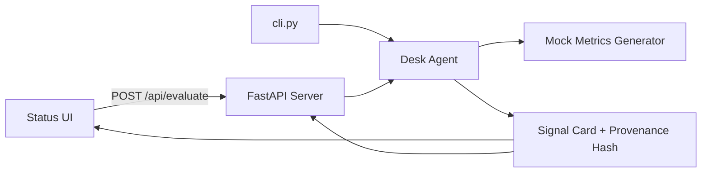

# Architecture — Morning Light Desk Sentinel

✝️🧿🪬

3️⃣🧿5️⃣

Local MVP for the **Trust / Identity & AI Infrastructure** track. The system demonstrates auditable AI-assisted desk decisions over synthetic data — no production trading, no chain claims.

---

## Overview



Three layers:

1. **Mock metrics** — deterministic-per-minute synthetic desk snapshot
2. **Desk agent** — rule-based evaluator → `CLEAR` | `SHORT` | `HOLD`
3. **Surface** — tiny web UI + REST API + CLI

---

## Mock metrics (`agent/metrics.py`)

Generates a `DeskMetrics` struct:

| Field | Role |
|-------|------|
| `order_flow_imbalance` | Primary directional cue (−1 sell … +1 buy) |
| `volume_delta_pct` | Volume momentum |
| `liquidity_score` | Execution depth proxy |
| `spread_stability` | Quote stability |
| `bid_ask_bps` | Spread width |
| `volatility_1h_pct` | Conviction dampener |

Metrics are **seeded by symbol + minute bucket** so repeated runs within the same minute are stable — useful for demos and hash verification.

---

## Desk agent (`agent/desk_agent.py`)

### Scoring

Weighted composite score in `[−1, +1]`:

- Order flow (35%)
- Volume delta (25%)
- Execution quality — liquidity × spread stability (20%, can penalize)
- Volatility dampener (20%)

### Decision thresholds

| Condition | Output |
|-----------|--------|
| `exec_quality < 0.4` or `|score| < 0.18` | **HOLD** + `safe_hold: true` |
| `score ≥ 0.42` and confidence OK | **CLEAR** |
| `score ≤ −0.42` and confidence OK | **SHORT** |
| Otherwise | **HOLD** + `safe_hold: true` |

Conservative by design: ambiguous states never masquerade as high-conviction calls.

### Signal card schema

```json
{
  "signal": "CLEAR | SHORT | HOLD",
  "summary": "One-line human summary",
  "safe_hold": true,
  "confidence": 0.0,
  "reasons": ["..."],
  "metrics": { },
  "provenance_hash": "sha256 hex",
  "agent_version": "0.1.0-mvp",
  "timestamp_ms": 0
}
```

---

## Provenance hash (trust layer)

```python
payload = {
  "agent_version": AGENT_VERSION,
  "metrics": metrics.to_dict(),
  "signal": signal,
  "safe_hold": safe_hold,
}
hash = sha256(json.dumps(payload, sort_keys=True))
```

Properties:

- **Deterministic** — same inputs → same hash
- **Self-describing** — hash input includes full metrics snapshot
- **Versioned** — agent version in payload supports upgrade audit trails

Future Monad integration (see `docs/MONAD_DEPLOY.md`) could anchor these hashes on-chain; this MVP stops at local SHA-256.

---

## Server (`server/app.py`)

- FastAPI on `127.0.0.1:8080`
- In-memory `_last_card` for UI polling via `/api/last`
- Static UI mounted at `/` and `/static/*`

No authentication, no external services, no secrets.

---

## UI (`ui/`)

Single-page status board:

- Owner branding line: ✝️🧿🪬
- Bot branding line: 3️⃣🧿5️⃣
- Signal badge with SAFE HOLD indicator
- Confidence, timestamp, reasons
- Full provenance hash (monospace, copy-friendly)

---

## Explicit non-goals (MVP)

- Live market data or broker connectivity
- Jito / MEV infrastructure
- Mainnet or testnet deployment claims
- LLM inference (rule-based agent only — predictable and auditable)

---

## Extension path

1. Replace mock metrics with signed feed adapters
2. Anchor provenance hashes via Monad (stub in `docs/MONAD_DEPLOY.md`)
3. Add identity attestation for agent version pinning
4. Optional LLM summarization layer **after** deterministic signal (never overriding HOLD safety)
