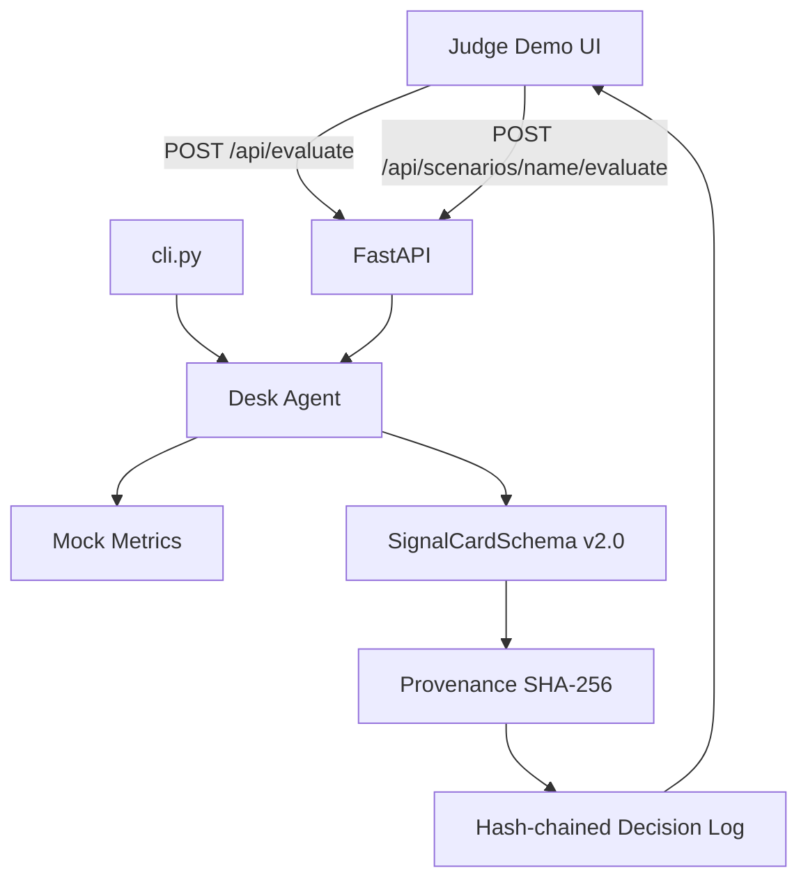

# Architecture — Morning Light Desk Sentinel

✝️🧿🪬

3️⃣🧿5️⃣

**Metropolis Monad · Trust / Identity & AI Infrastructure**

The product is **SAFE HOLD honesty** — an auditable desk agent that refuses soft lies over synthetic mock data.

---

## System overview



---

## Trust layers

### 1. Typed card schema (`agent/schema.py`)

Pydantic model enforces invariants at emission:

- `HOLD` → `safe_hold=true`, `trust_posture=REFUSAL`, refusal fields required
- `CLEAR` / `SHORT` → `safe_hold=false`, `trust_posture=DIRECTIONAL`, no refusal fields
- `reasons` + `reason_codes` always present (human + machine audit trail)

### 2. Provenance (`agent/provenance.py`)

```python
payload = {
  "agent_version": "1.0.0-metropolis",
  "schema_version": "2.0",
  "metrics": {...},
  "signal": "HOLD",
  "safe_hold": true,
  "trust_posture": "REFUSAL",
  "refusal_code": "EXEC_QUALITY",
  "reason_codes": ["THIN_LIQUIDITY", "REFUSAL_EXEC_QUALITY"],
}
provenance_hash = sha256(json.dumps(payload, sort_keys=True))
```

`verify_card_provenance()` recomputes and compares — used by API, log append gate, and UI.

### 3. Decision log (`agent/decision_log.py`)

Each entry:

```json
{
  "entry_id": 1,
  "logged_at": "2026-09-09T21:00:00+00:00",
  "prev_hash": null,
  "entry_hash": "abc...",
  "log_schema_version": "1.0",
  "card": { "...": "SignalCardSchema" }
}
```

- **Hash chain**: `prev_hash` links to prior `entry_hash`
- **Provenance gate**: invalid hash → append rejected
- **`verify_log_integrity()`**: detects tampering and broken chains

---

## Desk agent (`agent/desk_agent.py`)

Conservative thresholds (auditable constants):

| Constant | Value | Purpose |
|----------|-------|---------|
| `MIN_EXEC_QUALITY` | 0.40 | Refuse directional action on thin books |
| `MIN_EDGE` | 0.18 | Refuse when composite score too weak |
| `CLEAR_THRESHOLD` | 0.42 | Bullish only above trust band |
| `SHORT_THRESHOLD` | -0.42 | Bearish only below trust band |

**Invariant tested across 100+ seeds:** `CLEAR` never emitted when `exec_quality < MIN_EXEC_QUALITY`.

---

## Surfaces

| Surface | Role |
|---------|------|
| `ui/` | Judge demo — branding, scenarios, refusal panel, log tail, live verify |
| `server/app.py` | REST API + OpenAPI at `/docs` |
| `cli.py` | JSON evaluator with `--seed`, `--scenario`, `--verify` |

---

## Explicit non-goals

- Live feeds, wallets, Jito, MEV, mainnet claims
- LLM inference (rules only — predictable and auditable)
- Secrets in repo

---

## Extension path (post-hackathon)

1. Signed feed adapters replacing mock metrics
2. Anchor provenance hashes on Monad (`docs/MONAD_DEPLOY.md`)
3. Agent identity attestation pinning `agent_version`
4. Optional LLM summarization **after** deterministic signal — never overriding HOLD safety
